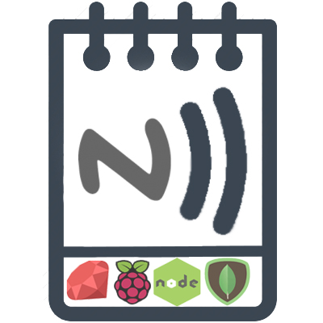

# NFC AGENDA


Client/Server Application that connects to hosted MongoDB database and manages student tasks,marks and timetables.

#### SERVER URL : ds245680.mlab.com:45680/pbe
#### DB URL : http://pbe-project.herokuapp.com/

### TO RUN SERVER IN LOCAL 
```
$ cd server
$ npm start
```

### PROJECT STRUCTURE

```
CLIENT/
├── Client.rb
└── UserInterface.rb
```
```
SERVER/
├── config/
│   └── database.js
├── models/
│   ├── mark_model.js
│   ├── student_model.js
│   ├── task_model.js
│   └── timetable_model.js
├── node_modules/
│   └── ...
│   
├── app.js 
├── fill_dbs.js
├── package-lock.json
├── package.json
└── utils.js
```

### DEMO IMAGES


